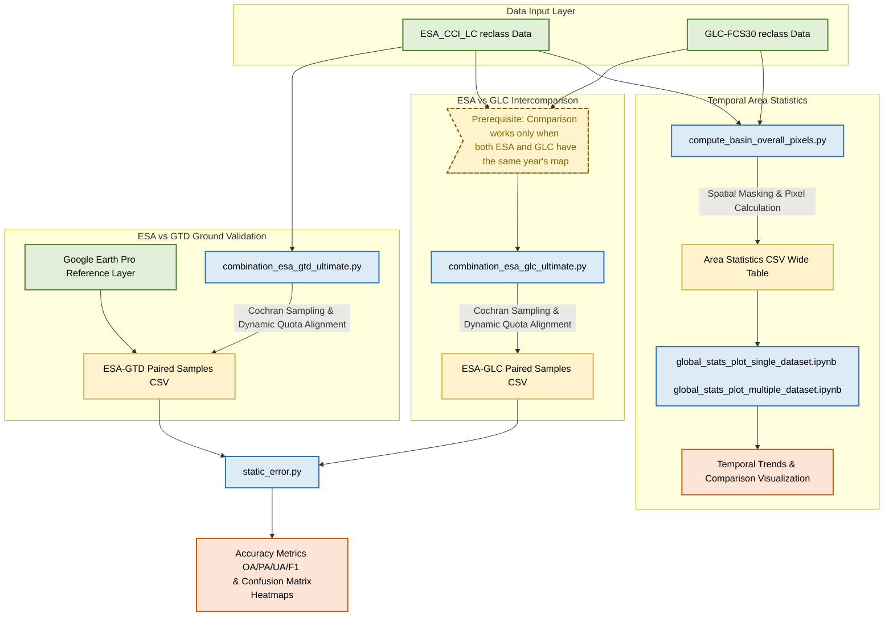
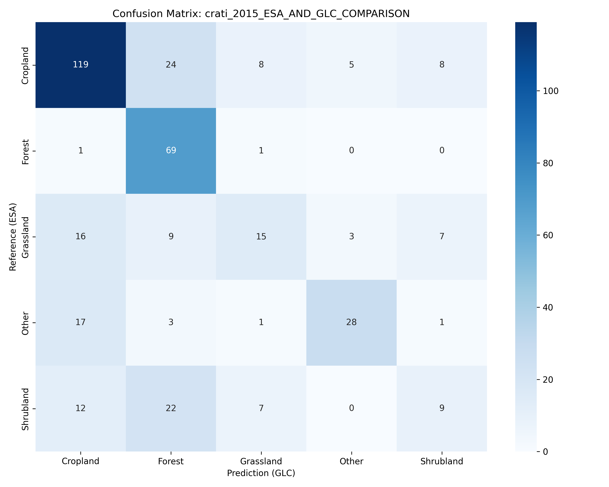
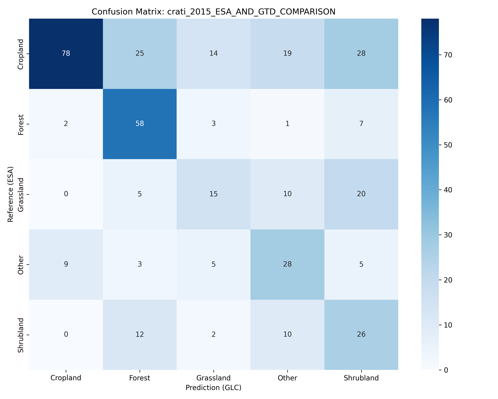

## 📈 Key Results (Accuracy Validation)

# Mediterranean Land Cover Products Comparison & Validation 🌍

## 📖 Project Overview

This project aims to analyze and validate two major global land cover products—**ESA CCI LC (300m)** and **GLC_FCS30 (30m)**.

Utilizing pre-processed satellite datasets provided by **Professor Daniele Oxoli**, which have already been standardized into a 10-class MOLCA legend, our core objective is to analyze their temporal area changes and perform a accuracy assessment. Following the professor's guidelines, the validation phase focuses specifically on vegetation classes (Forest, Shrubland, Grassland, Cropland) within all the river basin to ensure robust statistical evaluation.

## 🛠️ Methodology & Workflow

1. **Data Harmonization & Area Extraction**:

   * **In-Memory Geoprocessing**: Programmatically processed native NetCDF (.nc) and TIFF datasets via `xarray` and `rasterio`, preserving original metadata integrity without generating intermediate files.
   * **Equal-Area Projection**: Dynamically reprojected all spatial layers to `EPSG:3035` to eliminate latitude distortion, ensuring absolute physical area (km²) calculations for temporal change detection.
   * **Categorical Reclassification(Professor Daniele Oxoli's work)**: Standardized raw pixel values from both satellite maps into a unified schema. The numeric pixel mapping is aggregated as follows: Forest (20), Shrubland (5), Grassland (7), Cropland (8), and a composite 'Other' category (combining Wetland 9, Lichens/Mosses 11, Bareland 12, Built-up 13, and Ice/Snow 16). Pixels representing Water (15) and No Data (255) are in the "excluded" category.
2. **Temporal Trend Analysis**:

   * **Cross-Product Statistics**: Computed cumulative gains, losses, and net balances to quantify spatial discrepancies among the ESA and GLC and the ground truth datasets.
   * **Automated Visualization**: Generated stacked bar charts and time-series line plots to track long-term land cover evolution across the target basins.
3. **Rigorous Accuracy Validation**:

   * **Stratified Random Sampling**: Applied **Cochran's formula** (95% confidence level, 5% margin of error and 0.5 U(Estimated Proportion)) to derive statistically robust sample sizes, dynamically allocating point quotas based on class area proportions.
   * **Ground Truth Acquisition**:  Utilized geographic coordinates (`EPSG:4326`) derived from the ESA-CCI-LC product as the sampling baseline. These points were integrated into **Collect Earth** for systematic visual interpretation within **Google Earth Pro**, establishing the absolute ground truth through manual categorical identification of land cover types based on high-resolution historical imagery.
   * **Error Assessment**: Automated the computation of **Confusion Matrices**, **Overall Accuracy (OA)**, and **Macro F1-Scores** to quantitatively determine product reliability.

## 📁 Repository Structure

#### 1. Data & References

* **`data/`** : The core directory containing all geospatial data. It includes the vector boundaries of the study basins (`bbox_study_areas.gpkg`). Users must manually place the reclassified `.nc` files into the `ESA_CCI_LC_reclassified` folder and `.tif` files into the `glc-fcs30` folder.  *(Note: Large raw files >50GB are ignored via `.gitignore`)* .
* **`reclass_table.xlsx` & `info_data_caracteristics_and_pre_processing.pdf`** : Official reference documents provided by  **Professor Daniele Oxoli** . They detail the **10-class MOLCA standard** (e.g., 20 for Forest, 5 for Shrubland) applied during the data pre-processing phase.

#### 2. Temporal Area Statistics

* **`compute_basin_overall_pixels.py`** :  **Temporal Area Statistics Calculator (Core Data Extraction Pipeline)** . Responsible for directly reading native NetCDF and TIFF raster files. It first reprojects the CRS from  **EPSG:4326 to EPSG:3035** , then performs in-memory masking using the basin vector boundaries to accurately calculate the absolute pixel area for each year and MOLCA land cover class. Results are exported as wide-format area statistics CSV files.
* **`global_stats_plot_single_dataset.ipynb`** :  **Single-Dataset Temporal Trend Analyzer** . Ingests the generated area CSVs to compute cumulative gains, losses, and the net balance of each land cover class for a single data source (ESA or GLC). It generates temporal evolution visualizations (e.g., stacked bar charts).
* **`global_stats_plot_multiple_dataset.ipynb`** :  **Multi-Dataset Comparative Analyzer** . Also reads the area CSVs to horizontally compare the spatial area evolution differences between the ESA and GLC datasets over the same time series, providing joint statistical analysis and visualizations for multi-source datasets.

#### 3. Accuracy Validation & Error Assessment

* **`combination_esa_glc_ultimate.py`** :  **ESA-GLC Spatial Pairing & Sampling Engine** . Used for the cross-validation of the two global land cover maps. It first determines the total statistical sample size for a specific basin and year based on  **Cochran's formula** , allocating quotas proportionally by area. To ensure statistical validity, a  **minimum threshold of 50 points is enforced for minor classes** , and the remaining points are proportionally redistributed. It then generates random coordinates on the reference map (ESA) to extract classes, dynamically reprojects these coordinates to the target map's (GLC) native CRS to extract co-located classes, and outputs a structured CSV containing coordinates and the paired classification attributes from both maps.
* **`combination_esa_gtd_ultimate.py`**: **ESA Ground Truth Sampling & Template Generator**. Shares the same underlying statistical logic as the ESA-GLC script (Cochran sampling + minimum 50-point threshold). However, rather than automated pairing, this script exclusively generates spatial sampling coordinates from the reference map (ESA) across all basins and years. It outputs a baseline CSV template containing these coordinates and their ESA classifications. **Crucially, this initiates a semi-automated workflow:** users must manually ingest these coordinates into **Collect Earth** and **Google Earth Pro** to visually interpret the high-resolution imagery and manually record the actual terrain truth. Only after this manual ground truth data collection is completed can the finalized CSV be utilized for downstream error analysis and Confusion Matrix generation.
* **`static_error.py`** :  **Accuracy Assessment & Error Matrix Generator** . Reads the paired sample CSVs generated by the sampling scripts to automatically compute standard remote sensing error metrics: Overall Accuracy (OA), Producer's Accuracy (PA), User's Accuracy (UA), and F1-Score, exporting the statistical results to a CSV. Concurrently, it automatically generates and exports visual  **Confusion Matrix heatmaps (PNG format)** .

#### 4. Auxiliary Tools & Setup

* **`ground_truth_data_generation_esa.py` & `ground_truth_data_generation_glc.py`** :  **Single-File Sampling Auxiliary Scripts** . Slightly less critical than the 'Ultimate' versions. Each run processes only a single file. Their primary function is to determine the required random sample points per class and generate a CSV with coordinates and classes. Additionally, they  **generate KML files** , allowing users to import them directly into Google Earth Pro for visual interpretation of actual landforms and ground truth data collection.
* **`requirement.txt`** : The list of Python dependencies required to run the project, enabling one-click environment setup (`pip install -r requirement.txt`).

## 💻 Tech Stack

* **Data Engineering**: `xarray`, `rioxarray`, `geopandas`, `rasterio`, `pandas`, `numpy`
* **GIS Tools**: QGIS, Google Earth Pro, Collect Earth

## 🚀 How to Run

1. git clone this project to your computer
2. drag and drop your **geotiff** files into the **/data/glc-fcs30** folder and your **netcdf** files into the **data/ESA_CCI_LC_reclassified** folder.
3. Install required dependencies: `pip install -r requirements.txt`
4. Then you can run the python script.

## 📊 Project Data Workflow(Pipeline)

## 📈 Final Validation & Error Analysis (Example: Crati Basin with GLC and ESA, 2015)

As the final stage of the entire data processing workflow, the paired sampling point data is fed into the error assessment module. Below are the cross-validation results for the **Crati Basin (2015)**, providing a quantitative analysis of the classification consistency between the ESA and GLC products via an automatically generated Confusion Matrix and standard remote sensing accuracy metrics.

### 1. Confusion Matrix Heatmap

*Visually represents the matching and misclassification between the ESA map and the GLC map across various land cover types. The diagonal (darker shades) indicates pixels where both classifications align.*

*(Note: This heatmap illustrates the pixel-level agreement between the two global land cover products.)*

### 2. Standard Accuracy Metrics

*Based on the confusion matrix, this table quantitatively calculates the Producer's Accuracy (PA), User's Accuracy (UA), F1-Score, and Overall Accuracy (OA) for each category.*

| Land_Cover_Class           | Total_Reference_ESA | Total_GLC     | Correct_Pixels | Producer_Accuracy (PA) | User_Accuracy (UA) | F1_Score         |
| :------------------------- | :------------------ | :------------ | :------------- | :--------------------- | :----------------- | :--------------- |
| Cropland                   | 164                 | 165           | 119            | 0.7256                 | 0.7212             | 0.7234           |
| Forest                     | 71                  | 127           | 69             | 0.9718                 | 0.5433             | 0.6970           |
| Grassland                  | 50                  | 32            | 15             | 0.3000                 | 0.4688             | 0.3659           |
| Other                      | 50                  | 36            | 28             | 0.5600                 | 0.7778             | 0.6512           |
| Shrubland                  | 50                  | 25            | 9              | 0.1800                 | 0.3600             | 0.2400           |
| **OVERALL ACCURACY** | **385**       | **385** | **240**  | **-**            | **-**        | **0.6234** |

### 💡 Key Insights:

* **Overall Performance**: The Overall Accuracy (OA) between the two satellite products in this region for 2015 is **62.34%**, which is relatively consistent with the long-term trend.
* **High-Reliability Classes**: **Forest** and **Cropland** continue to exhibit the highest consensus. Strikingly, the Producer's Accuracy (PA) for Forest reached **97.18%**, meaning almost all areas labeled as Forest by ESA were perfectly identified as such by GLC. However, GLC's lower User Accuracy (54.33%) for Forest indicates it tends to over-predict this class compared to ESA.
* **High-Confusion / Divergent Classes**: **Shrubland** and **Grassland** remain the most challenging categories, with PA scores of only 18.00% and 30.00%, respectively. The confusion matrix clearly shows that a massive portion of ESA Shrubland was misclassified by GLC as Forest (22 pixels) and Cropland (12 pixels). Similarly, ESA Grassland was frequently categorized as Cropland (16 pixels). This underscores a persistent systemic discrepancy in how the two algorithms define and detect transitional and mixed vegetation boundaries.

## 📈 Final Validation & Error Analysis (Example: Crati Basin with Ground Truth Data and ESA, 2015)

As the final stage of the entire data processing workflow, the collected Ground Truth Data (GTD) sampling points are paired with the map classification results and fed into the error assessment module. Below are the validation results for the **Crati Basin (2015)**. This section provides a quantitative analysis of the consistency between the ESA land cover product and the independently collected Ground Truth Data via a Confusion Matrix and standard remote sensing accuracy metrics.

### 1. Confusion Matrix Heatmap

*This heatmap illustrates the matching and misclassification between the reference data (Ground Truth) and the predicted results (ESA Map) across various land cover types. The diagonal (darker shades) represents the number of correctly classified sampling points.*

 *(Note: Heatmap generated by `static_error.py` based on 385 paired sampling points.)*

### 2. Standard Accuracy Metrics

*The following table summarizes the performance metrics based on the updated comparison data, including Producer's Accuracy (PA), User's Accuracy (UA), F1-Score, and Overall Accuracy (OA).*

| Land_Cover_Class           | Total_Reference_ESA | Total_Predicted_GTD | Correct_Pixels | Producer_Accuracy (PA) | User_Accuracy (UA) | F1_Score         |
| :------------------------- | :------------------ | :------------------ | :------------- | :--------------------- | :----------------- | :--------------- |
| **Cropland**         | 164                 | 89                  | 78             | 0.4756                 | 0.8764             | 0.6166           |
| **Forest**           | 71                  | 103                 | 58             | 0.8169                 | 0.5631             | 0.6667           |
| **Grassland**        | 50                  | 39                  | 15             | 0.3000                 | 0.3846             | 0.3371           |
| **Other**            | 50                  | 68                  | 28             | 0.5600                 | 0.4118             | 0.4746           |
| **Shrubland**        | 50                  | 86                  | 26             | 0.5200                 | 0.3023             | 0.3824           |
| **OVERALL ACCURACY** | **385**       | **385**       | **205**  | **-**            | **-**        | **0.5325** |

### 💡 Key Insights:

* **Overall Performance**: The Overall Accuracy (OA) for this comparison is **53.25%**, indicating significant divergence between the two land cover products in this specific dataset.
* **Cropland Precision vs. Recall**: Cropland exhibits a very high User's Accuracy (**87.64%**), meaning that when GTD predicts cropland, it is highly reliable. However, its Producer's Accuracy is notably low (**47.56%**), revealing that more than half of the actual ESA cropland area was missed or classified as something else by GTD.
* **Forest Consistency**: Forest remains the most stable category overall with the highest F1-Score (**0.6667**). Its Producer's Accuracy is strong (**81.69%**), though the User's Accuracy (**56.31%**) suggests GTD still over-predicts Forest to some extent.
* **Transitional Vegetation**:
  * **Shrubland** shows a moderate Producer's Accuracy (**52.00%**), but its User's Accuracy is quite low (**30.23%**), indicating a high rate of false positives (areas incorrectly labeled as shrubland).
  * **Grassland** continues to struggle with low consensus across the board (PA **30.00%**, UA **38.46%**), confirming it as the most challenging and easily confused land cover type in the Mediterranean basin.
