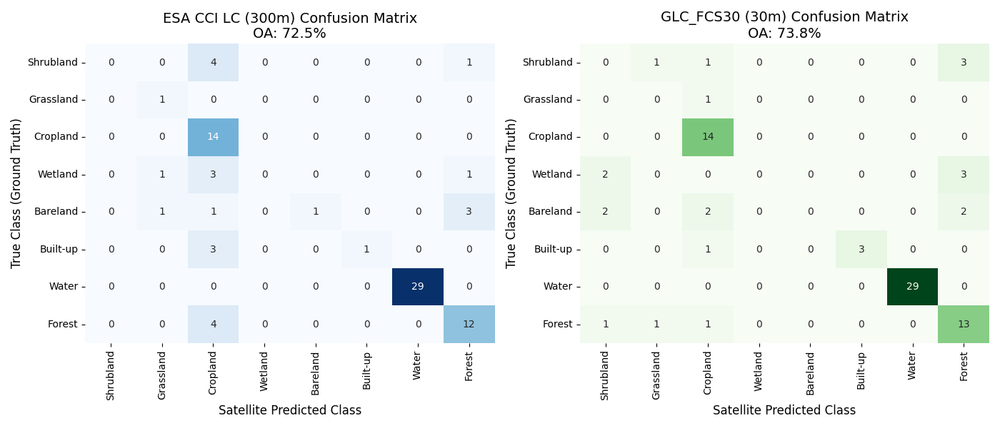
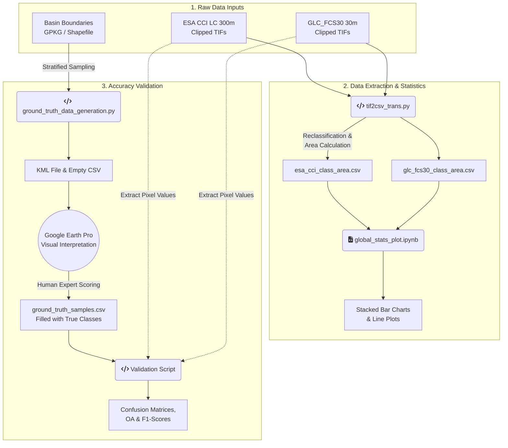

# Mediterranean Land Cover Products Comparison & Validation 🌍

## 📖 Project Overview

This project aims to compare and validate two major global land cover products—**ESA CCI LC (300m)** and **GLC_FCS30 (30m)**—across four representative Mediterranean river basins: **Tevere, Po, Ebro, and Crati**.

The core objective is to harmonize their different classification schemes into a standardized 10-class MOLCA legend, analyze their temporal area changes, and perform a rigorous independent accuracy assessment.

## 🛠️ Methodology & Workflow

1. **Data Harmonization & Area Extraction**:
   - Reclassified original satellite legends into 10 MOLCA target classes (Forest, Cropland, Built-up, etc.).
   - Processed spatial data to calculate absolute area ($km^2$) and relative changes over time.
2. **Visual & Statistical Analysis**:
   - Generated stacked bar charts and line plots to compare the classification consistency and discrepancies between the two datasets.
3. **Final Validation & Verification**:
   - **Validation is used as the final step to verify the actual performance of both satellite products.**
   - Generated random sampling points across the basins (`EPSG:3035` to `EPSG:4326`).
   - Conducted independent visual interpretation using historical high-resolution imagery to establish the absolute ground truth.
   - Computed **Confusion Matrix**, **Overall Accuracy (OA)**, and **Macro F1-Score** to determine product reliability.

## 📁 Repository Structure

* **`data/`** - Directory containing the geospatial data. It includes the vector boundary file (`bbox_study_areas.gpkg`) and the pre-clipped raster imagery (`.tif` files) for both ESA and GLC datasets across the four basins.
* **`reclass_table.xlsx`**
  - The fundamental harmonization dictionary. It defines the rules for translating the original, complex satellite classifications (30+ classes) into the standardized 10-class MOLCA target legend.
* **`tif2csv_trans.py`**
  - The core data extraction pipeline script. It reads the `.tif` rasters, applies the reclassification logic, calculates the absolute pixel areas ($m^2$ to $km^2$), and exports the results into structured CSV files.
* **`esa_cci_class_area.csv`** & **`glc_fcs30_class_area.csv`**
  - The processed statistical outputs generated by the script above. These tables store the annual area coverage for each MOLCA class, perfectly formatted for Jupyter Notebook ingestion.
* **`global_stats_plot_single_dataset.ipynb`**
  - Jupyter Notebook for single-dataset analysis. Generates visualizations like stacked bar charts to show the land cover evolution and net balance over time for a specific product.
* **`global_stats_plot_multiple_dataset.ipynb`**
  - Jupyter Notebook for cross-product comparative analysis. Generates overlapping line plots to directly highlight the discrepancies and agreements between the ESA and GLC datasets.
* **`ground_truth_data_generation.py`**
  - Python script used to perform stratified random sampling within the basin boundaries, generating the initial geographic coordinates needed for accuracy assessment.
* **`ground_truth_samples.kml`**
  - A Keyhole Markup Language file generated by the sampling script. It contains the 80 spatial "pins" to be loaded directly into **Google Earth Pro** for visual interpretation.
* **`ground_truth_samples.csv`**
  - **The absolute Ground Truth dataset.** Initially generated as an empty template, it has been manually filled with the true MOLCA classes via historical high-resolution visual interpretation. Used to compute the final Confusion Matrices and F1-Scores.
* **`README.md`**
  - The primary documentation file (this document) explaining the project's background, methodology, and workflow.

## 💻 Tech Stack

* **Python**: `geopandas`, `rasterio`, `pandas`, `numpy`
* **Machine Learning & Stats**: `scikit-learn` (Metrics), `seaborn`, `matplotlib`
* **GIS Tools**: QGIS, Google Earth Pro

## 🚀 How to Run

1. Install required dependencies: `pip install geopandas rasterio pandas scikit-learn seaborn`
2. Run data extraction: `python tif2csv_trans.py`
3. Execute Jupyter Notebooks for data visualization.

## 📈 Key Results (Accuracy Validation)

**Validation Setup & Methodology:**

* **Reference Year:** The ground truth data was strictly visually interpreted using **2015** high-resolution historical imagery from Google Earth Pro to ensure temporal consistency.
* **Sampling Strategy:** A stratified random sampling approach was applied, selecting **20 points per basin**, resulting in a total of **80 independent validation points** across the four Mediterranean basins.
* **Assessment Method:** The spatial coordinates of these 80 ground truth points were used to extract the corresponding pixel values from the **2015** datasets of both ESA CCI LC and GLC_FCS30 products for a direct, point-to-pixel comparative analysis.

Below is the confusion matrix comparing our 80 ground truth samples (Y-axis) with the satellite predictions (X-axis). It visually demonstrates the classification accuracy and specific misclassification areas for both products.

## 📊 Project Data Workflow(Pipeline)

